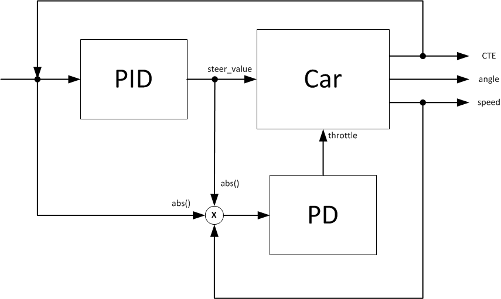
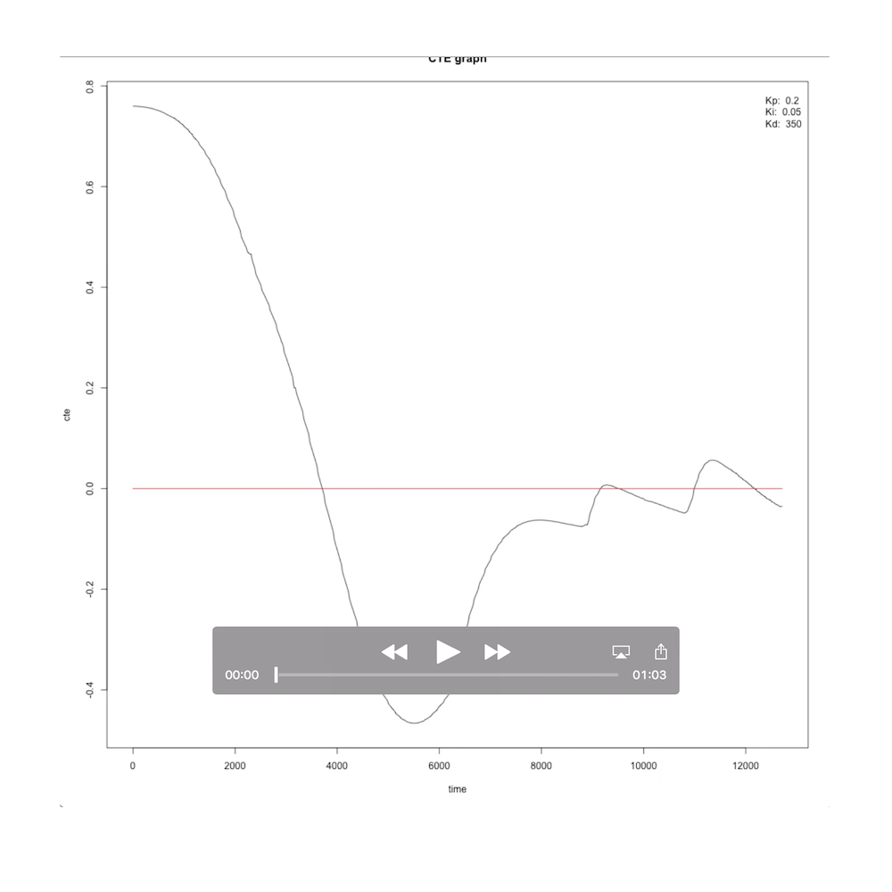
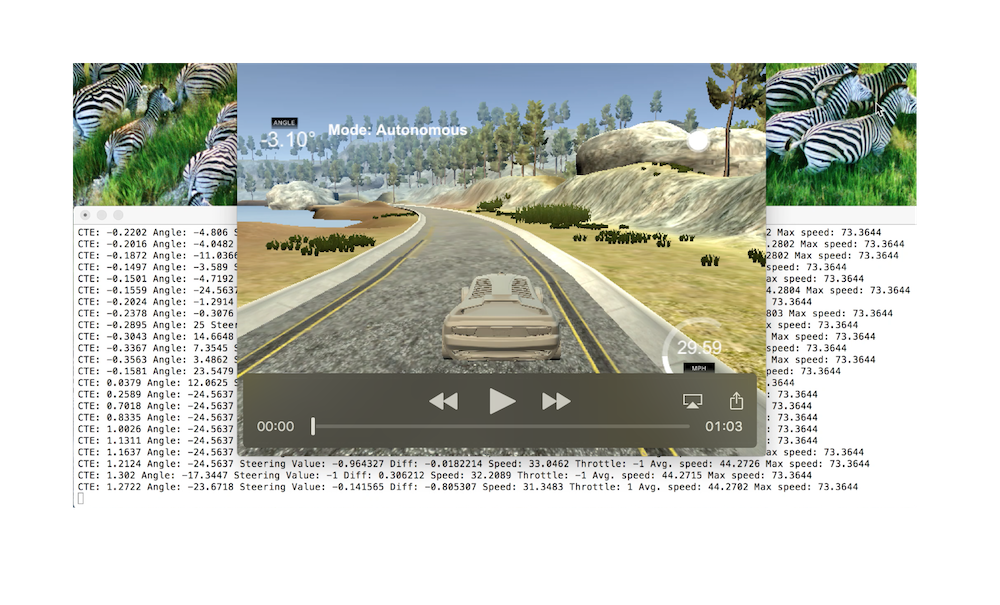

## PID-Controller
4th project of the 2nd term in Udacities Self Driving Car Course

# Problem Description

The task is to keep a car on a given track controlling the steering angle within the range [-25°, 25°] and a throttle within [-1, 1]. The measured values are the cross-track-error (CTE) for the current position of the car as well as the speed of the car. 
The task is to maximize the speed while keeping the car on the street (minimize the CTE). 

# Limitations

It's not possible to set the start position of the car within the test track nor can you determine the current position or the driven distance.

# Considerations

- High steering angles reduces also the speed of the car.
- CTE measurement errors. For example at start and at end of the bridge in the test track.
- New telemetry data will only be send after sending a steer command to the simulator. So processing time affects the sampling rate.

# Overview

# Parameter search

The PID parameters for steering control kp, ki and kd where found in a manual trail and error tuning manner. To objectify the process of tuning, the CTE over time where printed in a graph and evaluated for every parameter change for the first 500 telemetry updates using R. The video below illustrate the process (without being in the correct order).

# Results

To reduce load on the test machine and increase sampling time by minimizing the response time, the implementation is tested with the lowest simulator details and resolution of 640x480.

Without video capturing a average speed of approximately 45 mph (72.42 km/h) and a maximum speed of around 75 mph (120.7 km/h) can be achieved. Although the car sometimes oscillate a lot around the track center (still it's not an good idea to drink and drive) it keeps staying on the track without touching the road surface marking.

